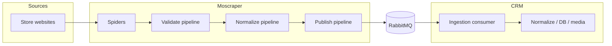

# MOSCRAPER PROJECT

## Overview

Moscraper is a **stateless** Scrapy-based scraper. It **does not persist** scraped business data on disk or in a database owned by this service. Each listing flows through validation and light normalization, then is emitted as a **CloudEvents-compatible** JSON message to **RabbitMQ** (`orjson`, **aio-pika**, publisher confirms, persistent messages).

**CRM** is the system of record: full normalization, deduplication and idempotency (`entity_key` + `payload_hash`), images, database writes, consumer retries, and dead-letter handling all live there—not in Moscraper.

## End-to-end flow



Plain-text equivalent:

```
Store websites → Scrapy spiders → item pipelines (validate → normalize → publish) → RabbitMQ → CRM consumer → CRM storage & processing
```

**Topology:** Moscraper may declare the **durable topic exchange** it publishes to. **Quorum queues and bindings** are owned by CRM / integration infrastructure unless they explicitly ask otherwise. Messages must stay compatible with quorum queues (persistent delivery, etc.).

## Key components

| Layer | Responsibility |
|--------|------------------|
| **Spiders** (`infrastructure/spiders/`) | HTTP (or optional Playwright) fetch, HTML/JSON extraction into domain-shaped items (e.g. `RawProduct`). |
| **Validate pipeline** | Pydantic v2 validation of scraped items before further processing. |
| **Normalize pipeline** | Minimal deterministic normalization (e.g. price as float, light title cleanup); keeps `raw_specs` / `description` opaque for CRM. |
| **Publish pipeline** | Builds the CloudEvents envelope and business `data` payload, then publishes to RabbitMQ. |
| **RabbitMQ publisher** | aio-pika channel with publisher confirms; **fail fast** on publish failure (no scraper-owned retry store). |

Orchestration entry points: `scrapy crawl <spider>` from the repo root, `application.parse_orchestrator.run_spider`, or the Docker Compose `scraper` service.

## No local database or scrape backlog

This project **does not** ship Postgres, SQLite, Redis-as-queue, migration tooling, or any “parser-owned” datastore for listings. There is nothing to migrate with application-owned schema tools in this repo.

Runs are **one-shot pipelines**: scrape → validate → normalize → publish. If the broker rejects a publish, the crawl fails; there is no local table of unsent work (tests may set `MOSCRAPER_DISABLE_PUBLISH` only).

## Explicit non-goals

Moscraper must **not**:

- own a database for scraped products or run migrations for such storage,
- keep a local queue of unsent payloads between runs,
- store product images or long-term raw HTML archives,
- run LLM-heavy or full semantic normalization in the baseline pipeline,
- maintain historical crawl state in-repo to compute “what changed” versus a previous run,
- push listings to CRM over **REST**,
- buffer failed publishes to disk or DB for later retry.

## scrapy-playwright (optional)

- **Not** part of the default baseline: core settings use plain HTTP download handlers.
- Install: `pip install '.[playwright]'` and `playwright install`.
- Use **scrapy-playwright** only for SPA / dynamic sites that need a browser.
- Opt in **per spider** via `custom_settings`, not globally. Example: `UzumSpider` (`infrastructure/spiders/uzum.py`); `MediaparkSpider` uses plain HTTP.

## Message contract

Envelope (CloudEvents-compatible):

| Field | Role |
|--------|------|
| `specversion` | `"1.0"` |
| `id` | UUID per publish |
| `source` | `moscraper://{store}` |
| `type` | `com.moscraper.listing.scraped` |
| `time` | UTC timestamp |
| `datacontenttype` | `application/json` |
| `subject` | `listing` |
| `data` | business payload |

`data` includes at minimum: `schema_version`, `entity_key`, `payload_hash`, `store`, `url`, `title`, `scraped_at`, plus optional price, stock, brand, `raw_specs`, `description`, `image_urls` (see `domain/messages.py`).

## Delivery model

- **Client:** aio-pika  
- **Confirms:** publisher confirms on the publish channel  
- **Persistence:** persistent messages  
- **Semantics:** at-least-once toward the broker; CRM must treat duplicates safely via idempotency keys  

If publish fails: **fail the run** — no local persistence (except `MOSCRAPER_DISABLE_PUBLISH` for automated tests only).

## Integration boundary

Moscraper knows only the **message contract** and **broker settings**. It does not know CRM tables, media layout, or deduplication storage.

## Scheduling

There is **no** Celery, Beat, APScheduler, or other in-repo periodic runner (the legacy `tasks/` package is not used). Trigger crawls with `scrapy crawl`, `application.parse_orchestrator.run_spider`, Docker Compose, or an external scheduler (**cron**, **GitHub Actions**, **Kubernetes `CronJob`**, etc.).

**Reliability:** durable exchanges, persistent messages, and publisher confirms ensure the broker accepts the write. Consumer-side retries, redelivery, and DLQ handling are **CRM** concerns.

## Configuration template

See **`.env.example`** (single template for the repo).

## Docker (local)

`docker-compose.yml` starts **RabbitMQ 3** (ports **5672**, management **15672**) and a **scraper** service from the repo `Dockerfile` (`scrapy crawl mediapark` by default). There is no database or Redis stack in Compose for Moscraper state.
