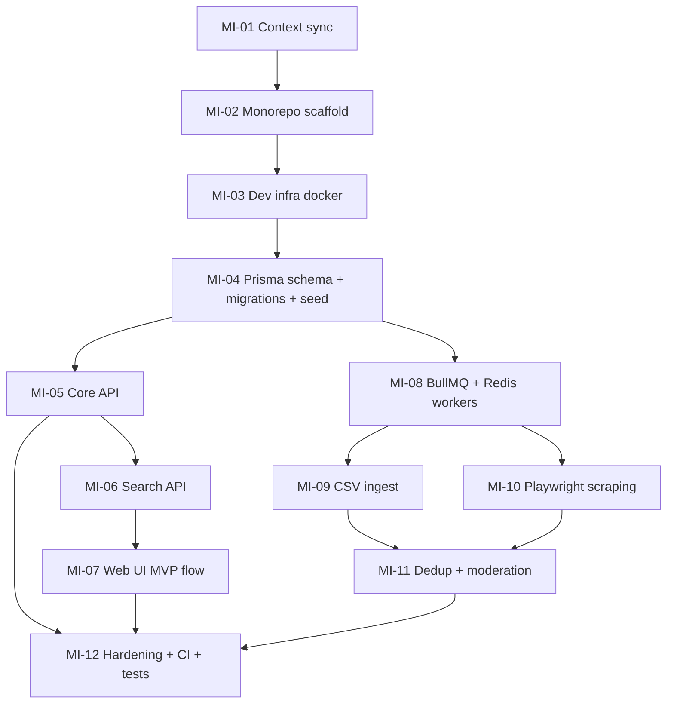

# План mini‑итераций MVP для разработки в Cursor по внутренним файлам проекта

## Executive summary

Вы уже заложили сильный “AI‑контур” (`.cursorrules`, `ai-context.md`, `mvp-context.md`, `project-context.md`, `cursor-prompts.md`, `env.structure`). Следующий шаг — превратить это в **последовательность маленьких, исполнимых mini‑итераций**, чтобы Cursor двигался по “конвейеру”: **прочитал контекст → сделал минимальный кусок → проверил → зафиксировал артефакты**.

Ниже — план 6–12 первых mini‑итераций для MVP с зависимостями, оценками в часах (ориентировочно), входами/выходами, критериями готовности, требуемыми MCP‑серверными “скиллами” и примерами prompt‑команд. Данные о команде/бюджете/SLA значениях — **не указано** (явно помечено).

## Какие ограничения и цели зафиксированы в файлах проекта

Ключевые “негибкие” правила (то, что Cursor должен соблюдать):

- Монорепо‑архитектура и границы слоёв: `apps: web, api, seller`, `services: scraper`, `packages: shared, db, ui`, при этом “API layer НЕ должен знать про scraping”, “Scraper НЕ должен содержать бизнес‑логику API”. (файл `.cursorrules`, строки 10–16)
- Модель данных: `Product` — нормализованный товар, `Offer` — цена/магазин; “Один Product имеет много Offer”, “Никогда не смешивать Product и Offer”, “Всегда сохранять original_source_data”. (файл `.cursorrules`, строки 24–31)
- Scraping только асинхронно через очередь и pipeline: “scraper → queue → processor → normalize → DB → search index”. (файл `.cursorrules`, строки 32–39)
- Async‑нагрузка: “Все тяжелые операции через очередь (BullMQ)”, “Никаких тяжелых операций в HTTP request”. (файл `.cursorrules`, строки 65–67)
- Multi‑tenant seller‑контур: “Всегда учитывать seller_id в запросах”. (файл `.cursorrules`, строки 45–48)
- Search: в правилах указан Elasticsearch “только для поиска”, а Postgres — source of truth. (файл `.cursorrules`, строки 40–43)
- В `project-context.md` MVP‑объём включает “scraping 3 магазинов” и “базовый seller кабинет”. (файл `project-context.md`, строки 117–124)
- Нефункциональные требования: “fast search (<300ms)” (из контекста), но среда измерения/методика — **не указано**. (файл `project-context.md`, строки 127–133)
- В `cursor-prompts.md` закреплён подход к постановке задач: маленькими шагами, с указанием где код и что сделать; “Сделай маркетплейс” — пример плохого запроса. (файл `cursor-prompts.md`, строки 4–10 и 22–26)
- Окружение: Postgres/Redis/Elastic/JWT/Telegram/S3 переменные заданы, но какие компоненты реально включать в MVP — частично конфликтует между файлами (Elastic фигурирует и как обязательный, и как “только для поиска”). (файл `env.structure`, строки 1–19; файл `project-context.md`, строки 75–90)

Практическая интерпретация для плана:
- P0 должен довести до “пользователь видит каталог/поиск/офферы/кликаут” + минимум инжеста, иначе продукта нет.
- Elastic включаем как **опциональный слой поиска (P1/P2)**, если Postgres‑поиск не проходит по latency/релевантности (решение “обязательно ли Elastic в MVP” — **не указано**, есть противоречивые сигналы в документах).

## Mini‑итерации для Cursor с артефактами, done‑criteria, MCP и проверками

Нотация:
- Mini‑итерация: 1–5 рабочих дней (ориентир 8–40 часов).
- Артефакты: конкретные файлы/папки/PR.
- Done‑criteria: измеримые условия готовности.
- MCP: какие сервера/скиллы Cursor должен использовать.

### MI‑01 — Context sync и фиксация рамок MVP
Приоритет: P0  
Оценка: 4–8 ч  
Зависимости: нет

Задача:
- Cursor читает: `.cursorrules`, `ai-context.md`, `mvp-context.md`, `project-context.md`, `product-context.md`, `cursor-prompts.md`, `env.structure`
- Формирует короткий “контракт разработки”: что строим в MVP / что запрещено / какие сущности обязательны.

Вход:
- 5 файлов контекста (см. выше).

Выходные артефакты:
- `docs/mvp-scope.md` (или аналог) с 3 блоками:
  1) MVP‑функции,
  2) НЕ входит (CRM/marketplace),
  3) принятые технические решения + “не указано” где нужно решение.

Done‑criteria:
- В документе явно перечислены запреты: не делать marketplace/CRM; границы API vs scraper; async через очередь; multi‑tenant. (опирается на `.cursorrules` 14–16, 65–67 и `cursor-prompts.md` 22–26)
- Отдельным пунктом отмечено противоречие “Elastic vs Postgres search” и способ разрешения (решение/методика — если не принято, то пометка “не указано”).

MCP:
- filesystem (обязательно)
- github (желательно, если храните в репо)

Примеры prompt‑команд в Cursor:
- “Прочитай файлы .cursorrules, project-context.md, product-context.md, cursor-prompts.md, env.structure. Суммаризируй в 20–30 строк: MVP scope / не входит / правила архитектуры / риски. Сохрани в docs/mvp-scope.md.”

Проверки:
- smoke: убедиться, что итоговый `docs/mvp-scope.md` не противоречит `.cursorrules` (особенно разделение API/Scraper).

---

### MI‑02 — Монорепо‑скелет + базовые workspace‑скрипты
Приоритет: P0  
Оценка: 12–20 ч  
Зависимости: MI‑01

Задача:
- Создать структуру монорепо, как минимум:
  - `apps/` (`web`, `api` — если разделяете; либо `web` как BFF)
  - `services/` (`scraper`/`ingest`)
  - `packages/` (`shared`, `db`)
- Задать единый TypeScript‑стандарт, eslint/formatter, общие скрипты.

Вход:
- правила структуры из `.cursorrules` (10–16)
- “не делать хаотичные файлы” (5)

Выходные артефакты:
- созданные папки
- корневой `package.json` (workspaces)
- базовые `tsconfig`/линтер конфиги (что именно — не указано; выбирайте минимально рабочее)

Done‑criteria:
- `npm run build`/`npm run lint`/`npm run typecheck` существуют и выполняются локально (конкретные скрипты и команды в docs уже примером показаны через npm — `product-context.md` 879–885)
- структура не нарушает `.cursorrules` (apps/services/packages на местах)

MCP:
- filesystem (обязательно)
- github (желательно) — зафиксировать первый рабочий baseline PR/commit

Примеры prompt‑команд:
- “Создай монорепо структуру строго по .cursorrules (apps/web, apps/api, services/scraper, packages/shared, packages/db). Не добавляй лишнего. Добавь минимальные npm scripts: lint, typecheck, test, build.”

Проверки:
- `npm run lint`
- `npm run typecheck`

---

### MI‑03 — Локальная инфраструктура dev: Postgres + Redis (+ опционально Elastic)
Приоритет: P0  
Оценка: 8–16 ч  
Зависимости: MI‑02

Задача:
- Поднять dev окружение через docker-compose.
- Синхронизировать `.env.example` с `env.structure`.

Вход:
- `env.structure` (DATABASE_URL, REDIS_URL, ELASTIC_URL, JWT_SECRET, TELEGRAM_BOT_TOKEN, S3_*)

Выходные артефакты:
- `infra/docker/compose.yaml` (или `docker-compose.yml`)
- `.env.example` (без секретов)
- `docs/dev-run.md` (как запустить dev)

Done‑criteria:
- `docker compose up -d` поднимает Postgres и Redis
- из приложения есть соединение к Postgres/Redis (проверка запросом/пингом)
- Elastic контейнер: включён как опциональный профиль (решение “обязателен в MVP” — не указано; но переменная ELASTIC_URL есть) (`env.structure` 7–9)

MCP:
- docker (обязательно)
- postgres (желательно для проверки подключения)
- redis (желательно для проверки подключения)
- filesystem

Примеры prompt‑команд:
- “Собери docker compose для Postgres+Redis. Переменные возьми из env.structure. Добавь .env.example. Напиши docs/dev-run.md с командами запуска и проверки.”

Проверки:
- `docker compose up -d`
- Postgres: “покажи список таблиц (должно быть пусто до миграций)”
- Redis: “проверь ping/ключи”

---

### MI‑04 — Prisma schema + миграции для core сущностей
Приоритет: P0  
Оценка: 20–40 ч  
Зависимости: MI‑03

Задача:
- Создать `packages/db/prisma/schema.prisma`
- Ввести минимальные таблицы:
  - Product, Offer, Category, Seller (из project-context)
  - PriceSnapshot (для истории цены; в docs это важно для каталога)
- Индексы и constraints: минимум для связей `Product 1..* Offer`. (логика указана в `.cursorrules` 24–28 и `project-context.md` 30–43)

Вход:
- сущности из `project-context.md` 14–55
- модель “Product→Offers” в `.cursorrules` 24–28

Выходные артефакты:
- Prisma schema + миграции
- seed‑скрипт (минимальный): 1–2 категории, 1 seller/provider, 1 продукт, 1 offer (чтобы UI/API не были пустыми)

Done‑criteria:
- миграции применяются на локальную БД без ошибок
- seed создаёт минимальный набор данных
- есть базовые индексы на ключевые поля (slug, foreign keys, offer->product, offer->seller)

MCP:
- postgres (обязательно для валидации схемы)
- filesystem
- docker (если БД в контейнере)

Примеры prompt‑команд:
- “Создай Prisma schema для Product/Offer/Category/Seller/PriceSnapshot согласно project-context.md. Добавь миграции и seed. Не добавляй marketplace сущности.”

Проверки:
- `npx prisma migrate dev` (или ваша команда миграций — если иная, то **не указано**)
- `npx prisma db seed`
- SQL smoke: `SELECT count(*) FROM product;` и `SELECT count(*) FROM offer;`

---

### MI‑05 — Core API (BFF): продукты, офферы, редирект‑кликаут
Приоритет: P0  
Оценка: 30–60 ч  
Зависимости: MI‑04

Задача:
- Реализовать базовые REST endpoints (минимум):
  - `GET /health`
  - `GET /products` (pagination)
  - `GET /products/:id`
  - `GET /products/:id/offers`
  - `GET /offers/:id/redirect` (кликаут)
- Ввести DTO и валидацию входных параметров (важно по `.cursorrules`: “Use DTO”, “Validate input”) (`.cursorrules` 21–22, 85)

Вход:
- правила API из `.cursorrules` 50–60
- принципы API из `project-context.md` 108–113

Выходные артефакты:
- route handlers (в `apps/web/app/api/...` или `apps/api/...` — решение разделения `web/api` **не указано**, но структура подразумевается в `.cursorrules` 10–12)
- DTO типы в `packages/shared`
- базовые интеграционные тесты (хотя бы 1–2)

Done‑criteria:
- endpoints возвращают корректные данные из Postgres
- pagination работает (page/pageSize или cursor — выбор **не указано**, но pagination обязателен: `project-context.md` 111–113)
- redirect endpoint логирует событие или минимум делает 302 (лог кликаута — если не делаете в MVP, пометка “не указано”)

MCP:
- filesystem
- postgres (проверка выборок)
- github (PR)
- (опционально) docker (если сервисы в контейнерах)

Примеры prompt‑команд:
- “Сделай API endpoint GET /products с pagination и DTO (строго по .cursorrules и API PRINCIPLES). Затем добавь GET /products/:id и GET /products/:id/offers.”

Проверки:
- `curl http://localhost:3000/api/health` (порт/путь — **не указано**, зависит от вашей реализации)
- SQL контроль: запросы не делают N+1 (см. `.cursorrules` 82)

---

### MI‑06 — Поиск (MVP): минимально рабочий search API
Приоритет: P0  
Оценка: 30–70 ч  
Зависимости: MI‑05 (частично), MI‑04

Задача:
- Реализовать `GET /search?q=` с базовой релевантностью.
- Выбор реализации:
  - В `project-context.md` указано “Поиск идет через Elasticsearch” (`project-context.md` 75–80)
  - Но в правилах `.cursorrules` Postgres — source of truth, а Elastic — только для поиска (`.cursorrules` 40–43)
- Компромисс в плане: P0 делаем Postgres‑based поиск (быстро), P1/P2 добавляем Elastic indexing, если нужно (решение “обязательно ли Elastic” — **не указано**, поэтому фиксируем как опциональную ветку).

Вход:
- требование “fast search (<300ms)” — целевой ориентир (`project-context.md` 132), но среда измерения — **не указано**.

Выходные артефакты:
- `/search` endpoint + тесты
- индексы/миграции (если добавляете search_vector/GIN — то миграцией)

Done‑criteria:
- поиск возвращает продукты с pagination
- есть базовый smoke‑тест “поиск по слову возвращает ожидаемый продукт”
- замер p95 latency локально (методика — **не указано**, поэтому фиксируем хотя бы “в dev < 500ms” как рабочее наблюдение)

MCP:
- postgres (обязательно, чтобы тестировать запросы/индексы)
- filesystem

Примеры prompt‑команд:
- “Реализуй GET /search?q= используя Postgres (минимально). Добавь индексы/миграции, чтобы запрос не был full scan. Не подключай Elasticsearch на этом шаге.”

Проверки:
- SQL EXPLAIN на поиск (через postgres MCP)
- `curl /api/search?q=...`

---

### MI‑07 — Минимальный веб‑интерфейс: search → product → offers → clickout
Приоритет: P0  
Оценка: 40–80 ч  
Зависимости: MI‑05, MI‑06

Задача:
- Реализовать критический пользовательский путь:
  - `/search` (страница)
  - `/p/[slug]` (карточка товара)
  - блок offers
  - кнопка “перейти” через redirect endpoint
- Важно: не добавлять marketplace/CRM разделы.

Вход:
- MVP scope по сути: “поиск / карточка товара” (`project-context.md` 119–123)

Выходные артефакты:
- страницы и компоненты
- минимум SEO: title/description (если делаете — как минимум на карточке)

Done‑criteria:
- пользовательский путь проходит end‑to‑end на seed данных (из MI‑04) и/или реальных
- offers отображаются, кликаут работает

MCP:
- filesystem
- (опционально) playwright (для e2e smoke)
- github

Примеры prompt‑команд:
- “Сделай страницу /search и /p/[slug]. Используй существующие API endpoints. Сфокусируйся на MVP‑потоке: поиск → товар → цены → переход.”

Проверки:
- ручной smoke в браузере
- e2e smoke (если настроено): открыть /search, кликнуть товар, проверить offers и редирект

---

### MI‑08 — BullMQ + Redis: каркас очередей и воркеров
Приоритет: P0  
Оценка: 30–60 ч  
Зависимости: MI‑03, MI‑04

Задача:
- Вынести асинхронные задачи в очередь (строго по `.cursorrules`: тяжёлое только в queue) (`.cursorrules` 65–67)
- Поднять worker процесс (services/scraper или services/ingest — naming не критичен, “services: scraper (standalone)” закреплено) (`.cursorrules` 11–12)
- Минимум: одна очередь `scrape` и одна `process` (детализация очередей может быть позже).

Вход:
- pipeline из `.cursorrules` (`scraper → queue → processor → normalize → DB …`) (`.cursorrules` 37–39)
- из `project-context`: scraping pipeline steps (`project-context.md` 83–90)

Выходные артефакты:
- модуль подключения к Redis
- worker skeleton + пример job
- smoke‑скрипт enqueue job

Done‑criteria:
- можно enqueue job; worker подхватывает и пишет результат/лог в консоль
- никаких scraping‑операций в HTTP handlers

MCP:
- redis (обязательно)
- docker (если Redis в контейнере)
- filesystem

Примеры prompt‑команд:
- “Сделай BullMQ каркас: connection, очередь, worker. Добавь demo job, который читает из БД 1 продукт и логирует результат. В HTTP ничего тяжелого не добавлять.”

Проверки:
- redis queue length/failed jobs
- лог воркера показывает получение/завершение job

---

### MI‑09 — Ingest MVP: CSV feed → Offer + PriceSnapshot
Приоритет: P1  
Оценка: 40–80 ч  
Зависимости: MI‑08, MI‑04

Задача:
- Реализовать ingest из CSV как самый предсказуемый источник данных (даже если “реальных” feed пока нет, формат можно начать с локального fixtures).
- Сохранять `raw_data`/original_source_data (требование закреплено в `.cursorrules`) (`.cursorrules` 30–31)
- Делать snapshot цены в `PriceSnapshot`.

Вход:
- сущность Offer с `raw_data` есть в `project-context.md` (строка 42)
- pipeline из `.cursorrules`

Выходные артефакты:
- parser CSV
- job `ingest_feed` в очереди
- fixtures CSV (тестовый)

Done‑criteria:
- импорт идемпотентен (повторный прогон не плодит дубликаты)
- создаются/обновляются offers
- вставляются snapshots при изменении цены (правило может быть простым)

MCP:
- filesystem
- postgres
- redis

Примеры prompt‑команд:
- “Реализуй ingest CSV через очередь. На вход CSV из fixtures. На выход — upsert Offer и вставка PriceSnapshot, с сохранением raw_data.”

Проверки:
- `SELECT count(*) FROM offer;` до/после
- повторный ingest не увеличивает count неконтролируемо
- наличие snapshots

---

### MI‑10 — Scraping MVP: Playwright для одного источника
Приоритет: P1  
Оценка: 60–120 ч  
Зависимости: MI‑08, MI‑04

Задача:
- Подключить Playwright в воркере и сделать 1 “коннектор” источника.
- Сохранение Offer + raw_data.
- Учитывать лимиты источника (rate / retry) на уровне очереди.

Вход:
- правило “Использовать Playwright для динамики” (`.cursorrules` 34)
- MVP scope хочет scraping нескольких магазинов, но начинаем с одного, чтобы стабилизировать pipeline (`project-context.md` 119)

Выходные артефакты:
- `services/scraper/connectors/<source>/...`
- worker job `scrape_source_<name>`
- fixtures HTML (на случай падения сайта/антибота)

Done‑criteria:
- worker успешно парсит хотя бы 1–5 карточек товаров и пишет offers
- graceful failure: при ошибке job ретраится по policy (значения backoff/лимиты — **не указано**, фиксируется минимально рабочими)

MCP:
- playwright (обязательно)
- redis
- postgres
- docker (если запускаете браузер в контейнере — зависит от вашей среды, **не указано**)

Примеры prompt‑команд:
- “Сделай scraping worker для одного магазина на Playwright. Результат — Offer в Postgres + raw_data. Никаких бизнес‑правил в scraper, только extraction+normalize.”

Проверки:
- запустить scraping job
- проверить в БД новые offers

---

### MI‑11 — Dedup MVP: GTIN → rules‑matching → ручная модерация (минимум)
Приоритет: P1  
Оценка: 40–80 ч  
Зависимости: MI‑10 (или MI‑09), MI‑04

Задача:
- Реализовать базовое сопоставление Offer→Product:
  - если есть GTIN — матчить напрямую
  - иначе правила по brand/model/title similarity (как минимум)
- Минимальная ручная модерация: endpoint/admin‑страница или хотя бы CLI‑скрипт “привязать offer к product”.

Вход:
- правила дедупликации в `project-context.md` (`brand`, `model`, `title similarity`) (строки 65–71)
- модель Product/Offer в `.cursorrules` (24–31)

Выходные артефакты:
- модуль matching
- таблица связки (если отдельная) или `product_id` у Offer
- admin endpoint/скрипт для ручного подтверждения

Done‑criteria:
- доля offer с product_id растёт после прогонов
- ручное подтверждение работает и не ломает данные

MCP:
- postgres (обязательно)
- filesystem
- github

Примеры prompt‑команд:
- “Реализуй дедуп: если Offer.gtin найден — матч по GTIN; иначе простое правило similarity (без ML). Добавь инструмент ручной модерации.”

Проверки:
- SQL: % offers с product_id
- ручной матч обновляет Offer и отражается на UI

---

### MI‑12 — Hardening для релиза MVP: тесты, smoke, CI, базовый rate limit
Приоритет: P2  
Оценка: 20–50 ч  
Зависимости: MI‑05–MI‑11

Задача:
- Сделать минимальный контур качества:
  - unit tests для нормализации/матчинга
  - integration tests для API/DB
  - smoke e2e (Playwright) для “search→product→offers→clickout”
- Добавить CI workflow, как минимум: lint, typecheck, test, build, migrate deploy (пример команд есть в `product-context.md`: `npm ci`, `npm run lint`, `npm run typecheck`, `npm test`, `npx prisma migrate deploy`, `npm run build`) (`product-context.md` 879–892)
- Базовый rate limit (в `.cursorrules` это обязательное правило security) (`.cursorrules` 86)

Вход:
- quality‑команды, показанные в `product-context.md` (879–892)
- security rules `.cursorrules` (84–87)

Выходные артефакты:
- `.github/workflows/ci.yml`
- тесты (unit/integration/e2e)
- простые smoke инструкции в `docs/release-smoke.md`

Done‑criteria:
- CI проходит на PR
- e2e smoke проходит на dev
- есть минимальные правила “не ломать архитектуру” и “не делать тяжёлое в HTTP” проверяемые код‑ревью/тестами

MCP:
- github (обязательно для CI/PR)
- playwright (для e2e)
- docker (если CI использует service containers локально — зависит, **не указано**)
- postgres/redis (локальная проверка)

Примеры prompt‑команд:
- “Добавь CI workflow: npm ci → lint → typecheck → test → prisma migrate deploy → build. Затем добавь минимальный e2e smoke тест на Playwright: search→product→offers→redirect.”

Проверки:
- локально: `npm run lint`, `npm run typecheck`, `npm test`, `npm run build`
- CI в GitHub Actions зелёный

## Где в документах упомянуты CRM и marketplace для передачи другому владельцу

Ниже — конкретные места, которые можно “передать владельцу CRM/marketplace”. По вашему требованию: **CRM помечен как “не входит в MVP”**.

Файл: `project-context.md`
- Marketplace/CRM как часть общей платформы (не MVP‑обязательство, а vision):
  - “предоставляет маркетплейс…” и далее “…marketplace… будущий CRM”. (строки 4–10)
- Seller type содержит “marketplace | external” (архитектурный маркер, но не означает реализацию заказов в MVP). (строка 52)
- Telegram: “будущий CRM через чат” (явно future). (строки 101–105)
- FUTURE: “full CRM” (явно после MVP). (строка 140)

Файл: `cursor-prompts.md`
- Прямой запрет‑пример: “Сделай маркетплейс” указан как BAD PROMPT (т.е. не задача для MVP‑реализации “с наскока”). (строки 22–26)

Файл: `product-context.md`
- Явное указание, что marketplace/CRM выносить в Scale‑фазу (т.е. не MVP):
  - формулировка в блоке “Проблемные зоны”: marketplace и CRM описаны как источники распыления, и рекомендуется вынести их из MVP. (строка 11; цитировать можно фрагмент до служебных ссылок)

Маркер для handoff:
- CRM: НЕ входит в MVP (по требованию) — владелец/команда CRM: **не указано**.
- Marketplace (заказы/оплата): для MVP не требуется, т.к. в текущих артефактах нет требований по оплатам/логистике/возвратам/фроду (всё это **не указано**).

## Как формулировать задачи для Cursor и как контролировать качество

### Шаблон prompt’а на mini‑итерацию (рекомендуемый)

```txt
Контекст:
- Следуй .cursorrules: (укажи 2–4 релевантных правила словами)
- Цель итерации: <MI-XX название>
- Где работаем: <путь папки: apps/web или services/scraper или packages/db>

Задача (маленькая):
1) ...
2) ...

Входные артефакты:
- <файлы/таблицы/эндпоинты, которые уже есть>

Выходные артефакты (обязательно перечислить):
- <список файлов/эндпоинтов/миграций>

Критерии готовности:
- <измеримые checks: команда/скрин/SQL запрос>

Запрещено:
- marketplace/CRM/ML/сложные фичи (если не в этой итерации)
```

Это напрямую соответствует “RULE 1–2” из `cursor-prompts.md`: указывать где код и просить маленькими задачами. (файл `cursor-prompts.md`, строки 4–10)

### Примеры промтов для трёх режимов работы Cursor

a) Read‑and‑summarize

```txt
Прочитай: .cursorrules, project-context.md, product-context.md, cursor-prompts.md, env.structure.
Суммаризируй:
- MVP scope (что сделать)
- OUT OF SCOPE (CRM/marketplace)
- обязательные правила архитектуры
- 5 ключевых сущностей и связи
Сохрани результат в docs/mvp-scope.md.
Код не пиши.
```

b) Implement‑step

```txt
Итерация MI-05 (Core API).
Где код: apps/web/app/api (Route Handlers) + packages/shared (DTO) + packages/db (Prisma client).
Сделай:
- GET /health
- GET /products (pagination)
- GET /products/:id
Добавь DTO и валидацию query/path параметров.
Запрещено: тяжёлые операции в HTTP, scraping, marketplace/CRM.
Покажи изменённые файлы и кратко объясни.
```

c) Test‑and‑verify step

```txt
Проверь итерацию MI-05:
1) Запусти lint/typecheck/tests/build (npm run lint/typecheck/test/build).
2) Сделай smoke: curl /health и /products.
3) Через Postgres проверь, что выборки корректные (SELECT count(*) и пример JOIN без N+1).
Верни отчёт: что запускалось, что прошло, где проблемы и как исправить.
```

### Правила контроля качества (lightweight, но системно)

- Code review checklist (ручной):
  - не нарушены границы API vs scraper (см. `.cursorrules` 14–16)
  - входы валидируются (см. `.cursorrules` 22, 85)
  - нет тяжёлых операций в HTTP (см. `.cursorrules` 65–67)
  - pagination и фильтры где положено (см. `.cursorrules` 58–60 и `project-context.md` 111–113)
- Тестовый минимум к релизу (MI‑12):
  - unit: нормализация/матчинг
  - integration: API + DB
  - e2e smoke: search→product→offers→redirect

## Компактный план запуска MVP и зависимости

Ниже — компактные 12 mini‑итераций, чтобы довести до запуска MVP. Оценки в часах ориентировочные; скорость команды, количество разработчиков, бюджет — **не указано**.

Backlog (plain text)

+--------+-----------------------------------------------+----------+-----------+----------------------------+
| ID     | Описание                                      | Priority | Est. (h)  | Depends on                 |
+--------+-----------------------------------------------+----------+-----------+----------------------------+
| MI-01  | Context sync: mvp-scope.md                    | P0       | 4–8       | -                          |
| MI-02  | Монорепо скелет + базовые скрипты             | P0       | 12–20     | MI-01                      |
| MI-03  | Dev infra: docker compose (pg+redis+opt elastic)| P0     | 8–16      | MI-02                      |
| MI-04  | Prisma schema + миграции + seed (core tables) | P0       | 20–40     | MI-03                      |
| MI-05  | Core API: products/offers/redirect/health     | P0       | 30–60     | MI-04                      |
| MI-06  | Search API (Postgres-based)                   | P0       | 30–70     | MI-04, MI-05               |
| MI-07  | Web UI MVP flow                               | P0       | 40–80     | MI-05, MI-06               |
| MI-08  | BullMQ+Redis каркас воркеров                  | P0       | 30–60     | MI-03, MI-04               |
| MI-09  | CSV ingest → offers + price snapshots         | P1       | 40–80     | MI-08, MI-04               |
| MI-10  | Playwright scraping 1 источник                | P1       | 60–120    | MI-08, MI-04               |
| MI-11  | Dedup GTIN/rules + ручная модерация (мин.)    | P1       | 40–80     | MI-09 or MI-10, MI-04      |
| MI-12  | Hardening: тесты+CI+smoke+rate limit          | P2       | 20–50     | MI-05..MI-11               |
+--------+-----------------------------------------------+----------+-----------+----------------------------+

Mermaid зависимости (flowchart)



Если хотите, я могу дополнительно (в рамках этого же подхода mini‑итераций) сделать “пакет промтов” — по одному готовому prompt’у для Cursor на каждую итерацию MI‑01…MI‑12 (чтобы вы просто копировали/вставляли и получали предсказуемый результат).